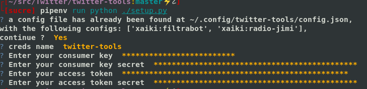

# Deleted tweets monitoring

This is a collection of tools to monitor deleted tweets, automate screenshoting, and archiving.

* `streaming.py` and `DB modules` work together to grab a real-time streamed timeline from Twitter and save all the results in a database, we currently support `SQLITE, MySQL and python networkx` but you can easily implement your own driver
* All the tweets in the database are then screenshot by `screenshot.py`
* Finally, the `monitoring.py` worker crawls through the database and checks if the tweets have been deleted.
* I included `get_user_ids.py`, as the Twitter API often requires the ID, and not the screen name (eg not "@basilesimon").

## Dependencies and install
* `git clone` this repo
* `wget https://raw.githubusercontent.com/pypa/pip/master/contrib/get-pip.py`
then `sudo python get-pip.py`
* pip install -r requirements.txt

# Configuration
there is a nifty tool that will generate a config file in the default location (`~/.config/twitter-tools/config.json`), just run `python3 ./setup.py` and you'll be prompted.



we'll pick up the first entry, not that we'll look for `./config.json` and
`../config.json` too, of course you can specify any file with the command
line.

it should look like this:
```json
[
    {
        "consumer_key" : "XXXXXXXXXXXXXXXXXXXXXXXXX",
        "consumer_secret" : "XXXXXXXXXXXXXXXXXXXXXXXXXXXXXXXXXXXXXXXXXXXXXXXXXX",
        "access_token": "XXXXXXXXXXXXXXXXXXXXXXXXXXXXXXXXXXXXXXXXXXXXXXXXXX",
        "access_token_secret" : "XXXXXXXXXXXXXXXXXXXXXXXXXXXXXXXXXXXXXXXXXXXXX"
    },
    {
        "consumer_key" : "YYYYYYYYYYYYYYYYYYYYYYYYY",
        "consumer_secret" : "YYYYYYYYYYYYYYYYYYYYYYYYYYYYYYYYYYYYYYYYYYYYYYYYYY",
        "access_token": "YYYYYYYYYYYYYYYYYYYYYYYYYYYYYYYYYYYYYYYYYYYYYYYYYY",
        "access_token_secret" : "YYYYYYYYYYYYYYYYYYYYYYYYYYYYYYYYYYYYYYYYYYYYY"
    },
    {
        "consumer_key" : "ZZZZZZZZZZZZZZZZZZZZZZZZZ",
        "consumer_secret" : "ZZZZZZZZZZZZZZZZZZZZZZZZZZZZZZZZZZZZZZZZZZZZZZZZZZ",
        "access_token": "ZZZZZZZZZZZZZZZZZZZZZZZZZZZZZZZZZZZZZZZZZZZZZZZZZZ",
        "access_token_secret" : "ZZZZZZZZZZZZZZZZZZZZZZZZZZZZZZZZZZZZZZZZZZZZZ"
    }
]
```


# for Mysql
* `pip install MySQL-python` (but you might need to `apt-get install
  build-essential python-dev libmysqlclient-dev`. I read it's easy to install
  on Max OS, with Homebrew)
* `apt-get install mysql-server` 

* `apt-get install nodejs-legacy nodejs npm`
* `sudo apt-get install build-essential chrpath git-core libssl-dev libfontconfig1-dev libxft-dev`
* `sudo npm -g install phantomjs`

### Comma-separated list of user IDs
I use the wonderful [t from sferik](https://github.com/sferik/t), a command line tool for twitter shenanigans.
Usually, I have an account following all the people I want to track - but it also works with lists.

* `$ t followings [account] > list.csv`
* `python get_user_ids.py > ids.csv`

## Run the program
Then to run it:
* Run `streaming.py`. Constantly. If it doesn't run, you're not saving the tweets.
* Run `nosetests screenshot.py --with-save-baseline --nocapture` periodically to grab the screenshots.
* Run `monitoring.py` periodically to check for deleted tweets.

You might want to consider running all these with `cron` on a server. Just saying.

## Integration with ElasticSearch
* `wget https://download.elasticsearch.org/elasticsearch/elasticsearch/elasticsearch-1.3.4.tar.gz`
* `tar -xvf elasticsearch-1.3.4.tar.gz`
* `sudo apt-get install default-jre default-jdk` to install Java
* Start ES instance with `bin/elasticsearch` in the directory where you extracted ElasticSearch

Then uncomment line 2 and 34-40 in `save_to_db.py`


## License
[PDD/ Unlicense](http://choosealicense.com/licenses/unlicense/)
